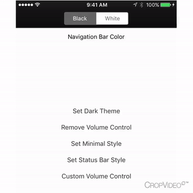

<p align="center">
  
</p>

[](http://cocoapods.org/pods/ABVolumeControl)
[](http://cocoapods.org/pods/ABVolumeControl)
[](http://cocoapods.org/pods/ABVolumeControl)

## Example

To run the example project, clone the repo, and run `pod install` from the Example directory first.

## Screenshots



## Description

A custom volume control that replaces MPVolumeView. There are several styles for ABVolumeControl, along with a delegate for creating one's own custom volume slider.

## Requirements

* Requires iOS 8.0 or later
* Requires Automatic Reference Counting (ARC)
* Requires MediaPlayer framework

## Installation

ABVolumeControl is available through [CocoaPods](http://cocoapods.org). To install
it, simply add the following line to your Podfile:

```ruby
pod "ABVolumeControl"
```

## Author

andrewboryk, aboryk@mercymavericks.edu

## License

ABVolumeControl is available under the MIT license. See the LICENSE file for more info.
